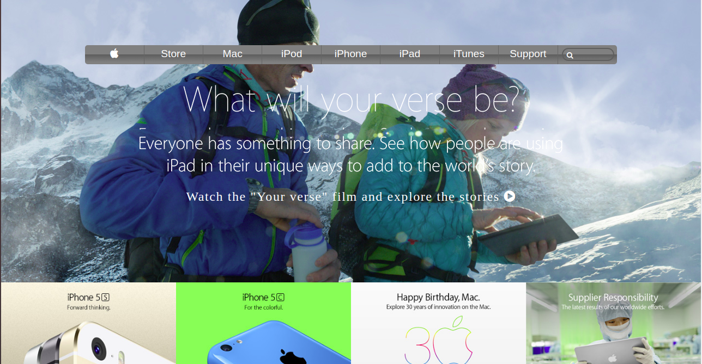

# apple-website-clone
This project is a clone of the [apple.com](https://web.archive.org/web/20140228164946/http://www.apple.com/) Apple Archived website

## Preview

### Additional description about the project and its features
 The purpose of this project is to practice building a web page using background image and linear gradient. The features of this simple web page are summarized below:
# A background image
  I added the background image using the background image link of the original web page. By using the CSS backround property and supplying the link as the content of the url. I used position values and no-repeat to make the image single and centered. The sections of the web page containing different images are laid out using CSS flex box.
# Menu bar
  I placed the menu bar at the top of the page with some margin from the top to make it stand out. The menu bar is contained within the nav element in the header. It has a linear gradient background to make it look beautiful. The menu items has white color to make them standout and readable within a dark grey background. The menu items are links to elaborate description of the various items as it relates to the apple.com web page. The inpute element within the menu with the search icon represents a searching point within the web page.
# H1 And H2 Elements
  H1 and H2 contains an image background. The source of the image which contains the beautiful write up is a link from the original web page. The images are enclosed within an anchor tag. The write up is a call to action which highlights what the page is all about.
# Sample products pictures
  Below the main background image of the body element, there are four different images placed using CSS flex box. They are links to the various items they represent. More information on each product can be obtained by clicking each of the images. 
# Footer
  The footer contains guides and links to some other parts of the page. The terms in blue are links to various parts of the page. The links are meant to open those topics for detailed explanation as it relates to the web page. The footer is placed using CSS grid.

## Built With
- HTML
- CSS
- CSS Flex box

## Live Demo
[Live Demo Link](https://rawcdn.githack.com/Zubenna/apple-website-clone/19e847eb15928005924912f130cfba43bff3e8b3/index.html) hosted on [githack](https://raw.githack.com)

## CDNs
- https://fontawesome.com/icons

## Steps For Installation
- After cloning this repo, git clone [repo](https://github.com/Zubenna/apple-website-clone.git), cd into apple-website-clone.
- Open the index.html file in your favourite browser, and that's it!!!

## Author
- Github: [@githubhandle](https://github.com/zubenna)
- Twitter: [@twitterhandle](https://twitter.com/zubenna)
- Linkedin: [@linkedin](https://linkedin.com/in/nnamdi-emelu-08b14340/)

## 🤝 Contributing
Contributions, issues and feature requests are welcome!
Feel free to check the [issues page](issues/).

## Show your support
Give a ⭐️ if you like this project!

## Acknowledgments
- Hat tip to anyone whose code was used
- Inspiration, etc

