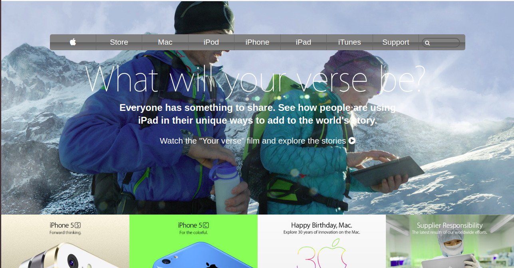

# apple-website-clone
This project is a clone of the [apple.com](https://web.archive.org/web/20140228164946/http://www.apple.com/) Apple Archived website

## Preview

### Additional description about the project and its features
- A background picture
- Menu bar
- Sample products pictures
- Menu and Search icons
- US Flag logo
- Footer

## Built With

- HTML
- CSS

## Live Demo

[Live Demo Link](https://rawcdn.githack.com/Zubenna/new-york-times-page/9a7db10c45e2b7aa939b83e16d177acfbd52844e/index.html) hosted on [githack](https://raw.githack.com)

## CDNs
- https://fontawesome.com/icons

## Steps For Installation
- After cloning this repo, git clone [repo](https://github.com/Zubenna/apple-website-clone.git), cd into new-york-times-page
- Open the index.html file in your favourite browser, and that's it!!!

## Author

👤 **Author**

- Github: [@githubhandle](https://github.com/zubenna)
- Twitter: [@twitterhandle](https://twitter.com/zubenna)
- Linkedin: [@linkedin](https://linkedin.com/in/nnamdi-emelu-08b14340/)

## 🤝 Contributing

Contributions, issues and feature requests are welcome!

Feel free to check the [issues page](issues/).

## Show your support

Give a ⭐️ if you like this project!

## Acknowledgments

- Hat tip to anyone whose code was used
- Inspiration
- etc

